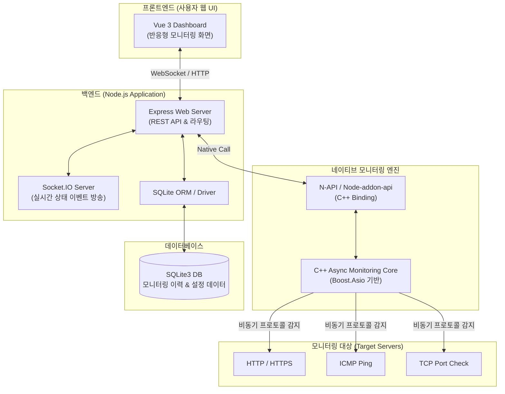

```mermaid
flowchart TD
    subgraph Client ["프론트엔드 (사용자 웹 UI)"]
        UI["Vue 3 Dashboard<br/>(반응형 모니터링 화면)"]
    end

    subgraph Backend ["백엔드 (Node.js Application)"]
        Server["Express Web Server<br/>(REST API & 라우팅)"]
        Socket["Socket.IO Server<br/>(실시간 상태 이벤트 방송)"]
        DB_Adapter["SQLite ORM / Driver"]
    end

    subgraph Native Engine ["네이티브 모니터링 엔진"]
        NAPI["N-API / Node-addon-api<br/>(C++ Binding)"]
        Engine["C++ Async Monitoring Core<br/>(Boost.Asio 기반)"]
    end

    subgraph Database ["데이터베이스"]
        DB[(SQLite3 DB<br/>모니터링 이력 & 설정 데이터)]
    end

    subgraph Target ["모니터링 대상 (Target Servers)"]
        Target1["HTTP / HTTPS"]
        Target2["ICMP Ping"]
        Target3["TCP Port Check"]
    end

    UI <-->|WebSocket / HTTP| Server
    Server <--> Socket
    Server <--> DB_Adapter <--> DB
    Server <-->|Native Call| NAPI <--> Engine
    Engine -->|비동기 프로토콜 감지| Target1 & Target2 & Target3
```
